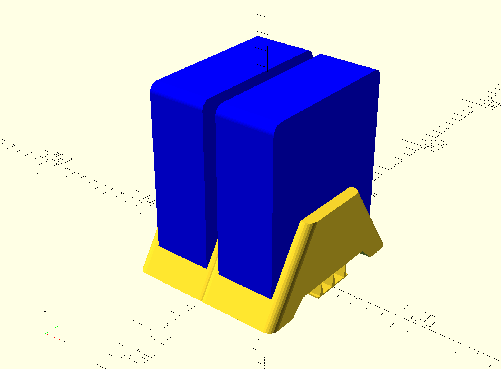

# 3D printable stand for the Beelink Mini S12 Pro PC

This is a desktop stand with the following features:
1. Vertically hold the computer to improve convection cooling for the bottom half of the mini PC (storage, DRAM, WiFI, etc.)
2. Bottom venting: do not block any vents!
3. Accessible ports: all ports are accessible

Printed with a 0.4mm nozzle at 0.2mm/layer with 25% infill.

* There are custom supports to help on long bridging. These can be turned off by setting `customSupport = 0;`
* Note that there is the ability to print a double stand (commented out in the code). See `beelink_stand_double.3mf` for ready-to-print model. 

The OpenSCAD code leverages the BOSL library: https://github.com/revarbat/BOSL

